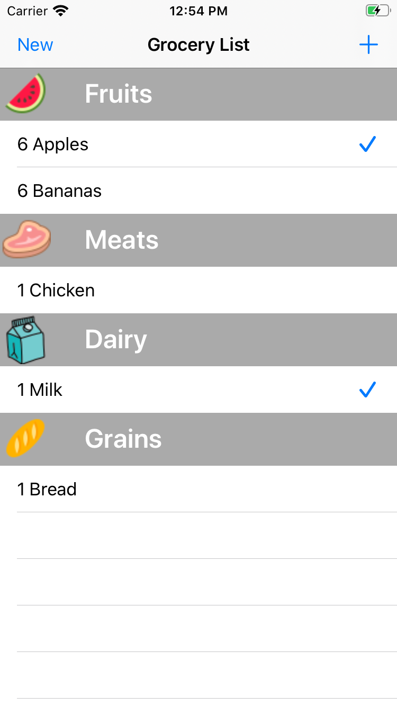
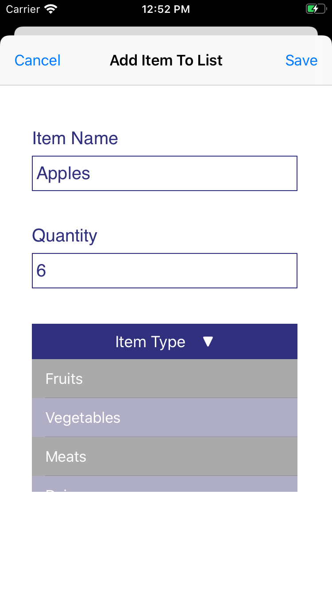

# GroceryShopping
iOS app to create a grocery list organized by product category. Items an be marked as complete.

## Screenshots
 

## Motivation
Wanted an easy way to keep track of what groceries are needed and mark items complete once added to the cart. Decided to sort each item by category to make the list clearer and the shopping experience faster.

## Features
* Ability to create a new grocery list
* Can add items to the list specify the name, quantity, and category
* List is sorted alphabetically and grouped by category
* Option to mark items as complete or remove from list

## Challenges 
* Had to test a few methods to determine the best way to pass data from the view controller where the grocery item is created back to the view controller with the main list
* Created a drop-down menu using a button and a table. Changed the height of the table when the button is clicked to make the drop-down menu either appear or disappear

## Things I Learned
* Used delegation to pass data back from the secondary view controller to the main view controller
* Persisted data by saving to the document’s directory of the app 

## Future Improvements 
* Add an option to edit an entry
* Add an option to save lists and start a new list based off a saved one. This option would allow a common weekly grocery list to be reused and added to.

